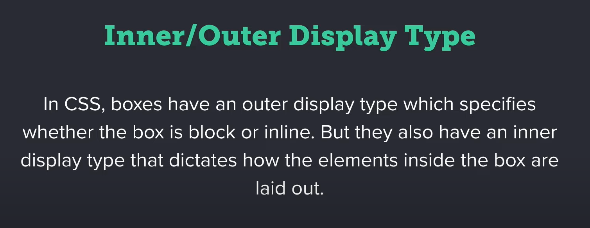

# About CSS

## What is CSS?

_CSS_ stands for **Cascading Style Sheets** and it's a styling language. It basically tells the browser how to represent an HTML document to the user like how to style text, how to layout the content, what colors to use and so on.

> [!KEEP IN MIND]
> HTML defines the structure of a web page, and CSS defines the styling of that web page.

When learning `CSS` we will often hear about terms _SASS_ & _LESS_.

![[sass&less.png]]

These are called as **pre-processors**, think about them as languages, because they extend the native language of _CSS_.

SASS and LESS are CSS, but with some added functionalities like variables, loops, if-else statements.

>Abbreviation
>_SASS_ - Syntactically Awesome Style Sheets
>_LESS_ - Leaner Style Sheets

```
key takeaways

1. `CSS` stands for Cascading Style Sheets and it's a `styling` language.
2. `CSS` basically tells the browser how to present an HTML document to the user.
3. Just like HTML, `CSS` is not a programming language because it's missing the logic part.
4. Remember: `HTML` defines the `structure` and `CSS` defines the `style` of a webpage.
5. Tools like `Sass` and `less` are `extending` the original CSS language by providing functionality like variables, loops and if/else statements.
```

---
## Adding CSS to an HTML Page

There are three ways we can add CSS to an HTML page, `inline`, `internal` and `external`.

>demo : 2_divElement

let's look at the inline method first,
### Inline

Basically means we're gonna add the CSS directly to an HTML element.

>[!Important]
>You should always keep presentation and structure separately.

### Internal

In Internal, we will use the style element inside the head element, and then write our CSS.

### External

External CSS is a way to separate the styling of a website from its HTML content. It involves placing CSS rules in a separate file with a `.css` extension. This file is linked to the HTML using a `<link>` element in the `<head>` section.

External CSS promotes modular design, reusability, and easier maintenance by allowing styles to be applied consistently across multiple web pages. It also enhances performance as the browser can cache the external CSS file for faster loading.

```
key takeaways

1. There are 3 ways we can add CSS to an HTML page: `inline`, `internal` and `external`.
2. The `inline` method implies using a `style` attribute on an element and it's considered `bad pratice`. DOn't use it.
3. Adding CSS `intentionally` means writing the CSS code inside a `<style>` element in the document's `<head>`. It's ok to use `occasionally` but not in production.
4. `External` CSS is written in a separate `.css` file and then loaded via a `<link>` element in the documents's `<head>`. This is the `recommended` way of loading CSS.
```

---

## Using CSS Selectors

The way CSS works is pretty simple. You tell the browser what elements you want to style, and then you tell the browser what elements you want to style, and then you tell it how to style those elements.

The first part, which is what elements to style, is typically done through selectors. So you're basically selecting what elements you want to work on.

The second part, how to style, is done through CSS rules.
### Anatomy of a selector and what type of selectors you can use


> demo : 2_divElement

Now, here is something that we haven't talked about, and that is `classes` and `ID` .
Classes and ID are both attributes that you can apply to an HTML element.

>_Class_ - something you can apply to an HTML element.
>_ID_ - Unique identifiers, which means you can apply an ID to a single element.

#### Universal Selector

universal selector is an **asterisk** (`*`), and this will select all the elements in the page.

#### Class Selector

The class selector is written like this, first a dot (.), and then the name of the class.

#### ID Selector

The ID selector starts with a hash sign (#), and then the name that i defined in the ID attribute.

>[!NOTE]
>CSS is read from top top bottom.

#### Type Selector

This selector selects all the elements that have the same node name.
Also we have _Selector List_ in *CSS* to group two or more types.

Selectors in a selector list can be of different types, such as element selectors, class selectors, ID selectors, etc.

Combining multiple selectors into a list allows you to efficiently apply the same styles to multiple elements without repeating the styles for each individual selector.

Before talking about the next selector,  which is called as _Descendant Combinator_

>demo : 8_cssSelectors

#### Descendant Selector

A descendant selector in CSS is used to select elements that are _descendants of a specified parent element_.

It allows you to target elements that are nested within another element hierarchy. The descendant selector is represented by a space (whitespace) between two selectors.

#### Attribute Selector

It will select any elements that have a given attribute.

The attribute selector in CSS is represented by square brackets `[]`. It allows you to target HTML elements based on the presence or specific values of their attributes.

```
key takeaways

1. CSS works by telling the browser `what` elements to style and `how` to style them.
2. CSS `selectors` are used to tell the browser `which` elements to style.
3. `Type selectors` will style all elements that have a certain `node name`. For example, the `div` selector will style all the `<div>` elements.
4. `Class and ID selectors` will style all the elements that have a specific `class` and, respectively `id`, attribute.
5. The " " `space` can be used as a `descendant combinator selector`. This will select all nodes that are `descendants` of the first element. For example, `div p` will match all the `<p>` elements inside a `<div>`.
6. You can apply the same CSS rules to `multiple` selectors. Just use a `comma` to group them, essentially creating a `selector list`. For example, `div`, `p` will match all the `<div>` and `<p>` elements.
7. The `universal selector (*)` selects `all elements`. You can also use it alongside the descendant combinator to select all elements that are descendants of another element. For example: `div *`
8. The `attribute selector` styles all the elements that have the given attribute. For example, `button[disabled]` selects all the `<button>` elements that have the `disabled` attribute.
```

---

## Working with Color in CSS

Probably one of the first styles you'll be applying in CSS is color.

> demo : 2_divElement

>[!CSS rules]
>collection of CSS properties that are applied to all of the elements that match the selector.

If you want to apply the same styles to a number of children, you can apply the styles directly to their parent and they'll be passed down.
In other words, children will inherit those properties from their parents.

### Color Formats

#### _HexaDecimal_

Represented by an **sRGB** color by using it's primary components, red, green and blue. Each component is written as a hex number.

The color value `#0099ff` can be interpreted as follows:

>- `00`: No red component (0 out of 255).
>- `99`: Green component at medium intensity (153 out of 255).
>- `ff`: Full blue component (255 out of 255).

In RGB color notation, the combination `#0099ff` results in a shade of blue with no red, a medium amount of green, and full blue intensity. This produces a vibrant blue color.

Alternatively, I can add two more digits representing opacity.

#### _RGB_

 The color format represents the levels of red, green, and blue. Adding transparency is simple using the `rgba` format, with 'a' denoting 'alpha'. A fourth parameter can be included, such as 0.675 for 67.5% transparency. A value of 1 signifies 100% opacity, while 0 means 0% opacity, rendering the color fully transparent.

> background-color: rgba(0, 153, 255, 0.67);

In this example, the `rgba` notation is used to create a color with blue as the dominant color, a medium amount of green, and 67% opacity.

#### _HSL_

Another format that's highly used, is **HSL** , this stands for _hue_, _saturation_ and _lightness_.

And this is represented by the first value being the hue or the position of the color on the color wheel. The second value represents saturation (like is it a vivid color or a dull color) and ranges from 0 to 100%. The third parameter represents lightness or luminosity, so how light is that color.

> background-color: hsl(43, 34%, 76%)

Also when working with color, we can also use keywords like **color: white**.

```
key takeaways

1. `color` and `background-color` are two of the most commonly used CSS properties for adding color.
2. The `color` CSS property sets the `foreground` color value of an element's `text and text decorations`.
3. The `background-color` CSS property sets the background color of an element.
4. Among the most commonly used formats for sRGB colors, we can find `hex`, `rgb` and `hsl`.
5. The `hex format` uses the `primary` color components (red, green and blue) written as hexadecimal numbers.
6. The `rgb format` expresses a color according to its `red`, `green` and `blue` components written either as numbers or percentages, where the number 255 corresponds to 100%.
```

---
## Let's Discover the CSS Units

As you're learning more and more about CSS properties, you'll see that most of these have numeric values. So what they have is a _number as a value_ and it have _units_.

We have the units that pertain to the environment that we're working with, so we have **pixels, em's, rem's, percentage's** and so on.

> demo : div_element

>[!NOTE]
>_pixel_ is an absolute unit whereas we also have relative units like _percentage_.

Also there are Other relative units we can use apart from percentages, those are _em_ and _rem_.

> __em__ - takes the font size of the parent element
> __rem__ - takes the font size of the html element

We can use the pixel, rem, percentage, em units in all sorts of properties, not just for font sizes or widths, we can set them for margins and paddings.

```
key takeaways

1. A lot of CSS properties have `numeric` values and most of those values use `units`.
2. On the web we can use various `units` to set various dimensions or create various layouts.
3. Among the most commonly used units in CSS we find `px`, `em`, `rem` and `%`.
4. The `px` unit sets an `absolute` size which is not usually influenced by external factors.
5. The `em` is a `ralative` unit that sets a size in relation to the `font size` of the parent element.
6. The `rem` is also a `relative` unit, but it works in relation to the `font size` of the `<html>` element.
7. The `%` is also a `relative` unit and it represents a `fraction` of some other value. In CSS, that other value is usually a dimension of the `parent` element.
```

>[!Annotation]
> As a beginner, these are the four units you need to be aware of , Once you are more comfortable with CSS, you will able to discover those other units yourself.

---
## Styling Text with CSS

Styling text in CSS is something that you'll be doing quite often because the majority of content in a webpage is text. Thankfully, CSS gives us some great tools we can use to style text any way we want.

> demo : Using Breaks to Separate content

```
key takeaways

1. CSS offers a lot of control over how text looks like.
2. `font-family`, `font-size` and `font-weight` are properties that cahnge the font you're using, the size of the text and the weight, respectively. You can also use `font-style` to switch to regular, italic or oblique.
3. The `text-transform` CSS property specifies how to `capitalize` an element's text. You can choose between `uppercase`, `lowercase` and a few others.
4. The `letter-spacing` property can be used to set the `horizontal spacing` between text and characters.
5. The `line-height` property is used to set the height of a `line box`. In other words, it changes the `distance between lines of text`.
6. You can align text in different ways by using the `text-align` property. For values you have `left` (which is the default), `center` and `right`. You can also use `start` and `end` as substitutes for `left` and `right`.
7. To change an element's appearance on mouse-over and mouse-press you can use the `:hover` and `:active` pseudo-classes. The `:active` pseudo-class is only applicable on a handful of elements (like buttons, links and certain inputs).
```

---

## Setting Dimensions in CSS

At some point in a project, you'll have to write some CSS to make an element bigger or smaller.

> demo : Setting Dimensions in CSS

In CSS, to make an element bigger or smaller, you would use the width and height properties. And they're self explanatory right, the `width` property changes an element's width, and the `height` property changes an element's height.

In terms of values for the width and the height, you can use absolute values like pixels or you can use relative values like `em`, `rem`, `percentage`, and you can even use some keywords, like auto,..

> [!NOTE]
> width and height only work on block and inline-block level elements.

Using `display: inline-block;` in CSS is a way to make an element behave like an inline-block element, allowing it to flow inline while still having block-level features.

You can also set relative elements like percentage and also set it to auto.

```
key takeaways

1. You can change an elements width or height by using the `width` and, respectively, `height` properties.
2. These accept the following value types: a `length` (expressed in `px`, `em`, `rem` and so on), a `percentage` or a `keyword` (for example: `auto`).
3. You can use the `min-width` and `max-width` to limit how `short` or `long` an element can be. The same is applicable for an element's height, by using the `min-height` and `max-height` properties.
4. You `cannot` change the width or height of an `inline` element.
```

---

## The CSS Box Model

The first thing you need to understand is in CSS, everything has a box around it, from images to paragraphs, from headings to spans.

> already explained in :  Block Vs Inline

Everything in CSS has a box around it, you must also understand that the box is not just a rectangle around an element, it's more complex than that. In fact, that box is made of several other boxes.

Have a Look at the CSS box model,..

![[boxModel.png]](https://github.com/DilshadNirmal/WebDesign/blob/main/Notes/images/boxModel.png)

> [!NOTE]
> The _browser developer tools_ are actually a great way of learning about the box model and how each element is constructed, starting from the content box, going to the padding box, border box, and then margin box.

> [!SIDE NOTE]
> The contents showed above **applies 100%** to block level elements but it doesn't do all the way for inline elements.

### Alternative Box model

> demo : 10_AlternativeBoxModel

The above mentioned `Box model` is the standard one, which can be done through CSS using,

> _box-sizing_ = **content-box**

which is default.

So in the standard box model, which is used by default, setting a width or a height to an element actually sets it to the content box, not the element itself.

>[!ADVICE]
>Always use alternative box model

### Margin and Padding properties

> demo : 9_SettingDimensions

Padding is a property that defines the space between an element's content and its inner edge.

>[!NOTE]
>The padding property can only accept positive numbers as a value.

The margin box sits outside the border box, so its purpose is to add whitespace around an element.
In CSS we often use that to create a certain distance between two elements.
Unlike paddings, margin can also receive negative values.

It's also very useful when you want to align two elements vertically and you need to nudge one of them up or down a couple of pixels.

There are certain elements that are positioned a certain distance from one another by default, that's because the browser has a default style sheet that it applies to elements.

#### Margin Collapsing

When two elements with margins are next to each other and the margins touch, these will collapse, and the resulting margin will take the value of the highest margin of two.

>[!KEEP IN MIND]
>Be aware of margin collapsing, because you might get unexpected results.

```
key takeaways

1. Everything in CSS has a `box` around it.
2. That box is made up of other boxes, as defined by the `CSS box model`.
3. A typical element has the following structure, moving from the inside outwards: `content box`, `padding box`, `border box` and `margin box`.
4. The box model doesn't fully apply to `inline` elements.
5. There are two types of box models: `standard` and `alternative`.
6. if we set a width or height using the `standard` model, that width will only be applied to the `content box`. Any padding and borders will add `additional` size to the visible element.
7. if we set a width or height using the `alternative` model, that width will be applied to the `entire visible element`. Any padding and borders will be `included` in that size.
8. The `margin` property will determine the size of the `margin box`. You can use the `shorthand` property to affect `all box sides` at once, or the `longhand` for setting each side `individually`.
9. CSS accepts `negative` values for `margin`.
10. If you have two elements with margins that `touch`, those margins will `collapse` to a single one. The size of the final margin depends on the size of the individual margins and also their sign.
11. The `padding` property will determine the size of the `padding box`. Just like margins, you can use either the `shorthand` or the `longhand` properties.
12. CSS only accepts `positive` values for `padding`.
```

## Working with Borders in CSS

The third box in the box model is the box model is the border box, and you can control the size of that using border properties.

> demo : 9_SetttingDimensions

>[!REMEMBER]
>The `dimensions` of the border box is dictated by _border properties_.

```
key takeaways

1. You can control the size and apperance of the `border box` with the `border` properties.
2. The `border-width` property controls the `thickness` or the `width` of an element's border.
3. The `border-color` property defines the border `color`.
4. The `border-style` property sets the `line-style` for an element's border. We can remove the border altogether with the value of `none`, or we can choose from the following values: `solid`, `dotted`, `dashed`, `double` and a few others.
5. The `border-radius` property rounds the `corners` of an element's outer border edge.
```

There are few other ways of adding a border or what we perceive as a border around an element such as the outline property or the box shadow property.

## Using the Display Property in CSS

Before we start coding, we need to learn about the two display types, inner and outer.




### Outer Display type

> demo : 6_forms&buttons

>[!NOTE]
>_Inline block_ is kind of the middle point between inline and block.
>With block elements, I can set width and height. And with inline elements, I can make two inline elements sit next to each other.

### Inner Display type

By default, they're laid out in normal flow just like the ones outside of the box.
But the nice thing in CSS is that we can specify how the inner elements will be laid out using stuff like flex box or grid.

> demo : 11_innerDisplayType

```
key takeaways

1. In CSS, boxes have an `outer display type` which specifies whether the box is `block` or `inline`. But they also have an `innner display type` that dictates how the elements `inside` the box are laid out.
2. The `display type` can be controlled through the `display` property.
3. For the `outer type`, we can use values like `none`, `block`, `inline` and `inline-block`.
4. The `inline-block` value allows an element to sit `next to other elements`, while also being able to accept a `width` and `height` and also display the top and bottom margin and padding correctly.
5. For the `inner type`, we can use values like `flex` and `grid`, among a few others.
```

## Styling Lists in CSS

Lists are very common in web design and they are very versatile.

> demo : 12_StylingLists

```
key takeaways

1. In CSS, lists can be styled using the following properties: `list-style-image`, `list-style-position` and `list-style-type`. Alternatively, use the shorthand `list-style`.
2. The `bullet point` or `number` in a list item can be `removed` by setting the `list-style` or `list-style-type` to `none`.
3. You can use an `image` as a list item marker with the `list-style-image` property. However, this is `not recommended` since it produces inconsistent results.
```

## Positioning Elements in CSS

> demo : 13_positioningElements

### Static Positioning

This is the default, and an element with position static uses the normal flow. And you cannot alter its position with the top, right, left, or bottom properties.

### Relative Positioning

With relative positioning, the element is also positioned using the normal flow of the document. But we can create offsets relative to itself by using the top, left, right and bottom properties.

>[!NOTICE]
>Elements around it are not affected, they maintain their original position.

### Absolute positioning

When we're using absolute positioning, the element is actually removed from the normal document flow, essentially it's floating, and it's positioned according to its nearest positioned ancestor.

when you set top or left or some other position to some value (ex: `top: 50px`) is actually relative to its nearest positioned ancestor. Meaning the browser looks up its nearest parent that has a position different than static.

>[!NOTICE]
>Absolutely positioned elements just scroll along with the page.

### Fixed and Sticky positioning

These are very similar in the sense that an element positioned either fixed or sticky will stay in the same place as you scroll but there is a subtle difference.

#### Let's start with Fixed

Fixed element will do three things. 
1. It will float just like an absolutely positioned elements.
2. It's gonna stay in the same place regardless of the scroll position.
3. It' gonna be positioned relative to the viewport, not its parent element.

#### How is that different than sticky positioning?

It's a bit newer, but also pretty powerful.
The sticky element we'll just scroll in a way just like any other element until it reaches a certain point.

That' the difference between sticky and fixed, a fixed element will stay fixed at all times it will not move. A sticky element is static by default until we reach a certain threshold.

>[!NOTE]
>A sticky element is static by default until we reach a certain threshold.

```
key takeaways

1. The `position` CSS property defines how an element is positioned.
2. The `final location` of a positoned element is determined by the `top`, `right`, `bottom`, and `left` properties.
3. By `default`, an element has the position value of `static` where the element is positioned according to the `normal flow`. The `top`, `right`, `bottom` and `left` properties have no effect.
4. An element with `position: relative` is positioned according to the `normal flow` of the document, but then can be `offset` relative to itself by using the `top`, `right`, `bottom` and `left` properties. The offset does not affect the position of any other elements.
5. An element with `position: absolute` is `removed` from the `normal document flow` and is positioned `relative` to its closest positioned ancester.
6. An element with `position: fixed` is also `removed` from the `normal document flow` and is positioned `relative` to the `viewport`. A fixed element stays in the same positon as the user scrolls.
7. An element with `position: sticky` is positioned based on the user's `scroll position` and will toggle between `relative` and `fixed`. The element is positioned relative until a given offset is met in the viewport. From that point its position set to fixed.
8. A `sticky` element stays `within` its parent so once the user scrolls past the parent, the sticky element is reverted back to a relative position.
```

## Styling Backgrounds in CSS

HTML elements can have two types of backgrounds, color and image.

In this one, we'll be focusing on image backgrounds. And this can be of two types.
We can use an actual image or we can use a CSS gradient.

> demo : 14_stylingBackgrounds

```
key takeaways

1. HTML elements can have two types of backgrounds: `color` and `image`.
2. The `background-image` CSS property sets one or more background images on an element.
3. Use the `background-size` property to set the size of the element's background image.
4. You can change the `position` of a background image by using the `background-position` property.
5. A background image will `repeat` itself `by default` but you can change this behaviour with the `background-repeat` property.
6. A great way of creating an interesting background is to use a `pattern` as a background image and have it `repeat` in both directions.
7. Color `gradients` can be created with the `linear-gradient` CSS function and applied as a value for the `background-image`.
8. The `background` CSS property is a `shorthand` that sets all backgrounds style properties at once, such as `color`, `image`, `size`, `repeat` or `poistion`.
```

## Building Layouts with Flexbox and CSS Grid

_Flexbox_ and _CSS Grid_ layouts are two of the most powerful tools you can use in CSS to create layouts.

>demo : 15_buildingLayouts

>[!Typical Behavior for Flexbox]
>By default items are set to stretch, which means they're gonna fill the only available space vertically.

### Flexbox

Using Flexbox, you can create super awesome alignment, and you will do that the following way.
You have two properties that can be used `justify-content` and `align-items`.

_justify-content_ - works on the horizontal axis.
_align-items_ - works on the vertical axis.

### CSS Grid

_CSS grid_ works with columns and rows, it's a two dimensional layout system.

>[!General Rule]
>Whenever you want your layout to shape the content, I use _CSS Grid_.
>With _Flexbox_, I'm letting the content shape the layout.

```
1. `Flexbox` is a `one-dimensional` layout method that allows us to place elements in rows ot columns.
2. In `flexbox`, items are displayed along what we call the `main axis` which, by default, is `horizontal`.
3. The `cross axis` is `perpendicular` to the main axis.
4. To control the alignment along the `main axis`, we can use the `justify-content` property.
5. To control the alignment along the `cross axis`, we can use the `align-items` property.
6. `CSS Grid Layout` (in short Grid or CSS Grid) is a `two-dimensional` grid-based layout system that allows us to place elements in rows and columns.
7. To define `columns` or `rows` in Grid, you can use the `grid-template-columns` and `grid-template-rows` properties.
```

## Working with Media Queries for Creating Responsive Websites

A responsive website will change its layout based on the medium it's being displayed on.
So a responsive website will look a certain way on a big screen and a different way on a small screen.

Now, achieving different layouts for different devices, is possible with CSS, cause of media queries.


> demo: _realesticdemo_


>[!NOTE]
>We can use ordering in both Flexbox and CSS Grid.
>We can change the order in which items are rendered in the page without actually changing the order in the HTML.

```
key takeaways

1. A `media query` is a technique we can use to modify how certain elements are rendered based on the `device type` (for example print or screen) or based on specific characteristics (like `screen resolution` or `browser width`).
2. `Media queries` represent a key of `responsive web design`, as they allow us to create different layouts depending on the size of the `viewport`.
3. A `media query` consists of three things. A `media type` which tells the browser what kind of media the code is for (example print or screen), a `media feature rule` which is a test that must be passed in order for CSS to be applied and finally the actual `CSS rules` that are to be applied.
```


# go to [[Projects]]


